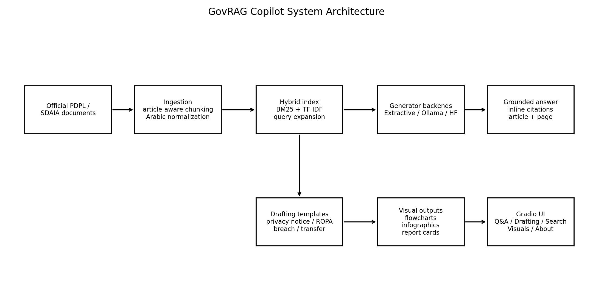
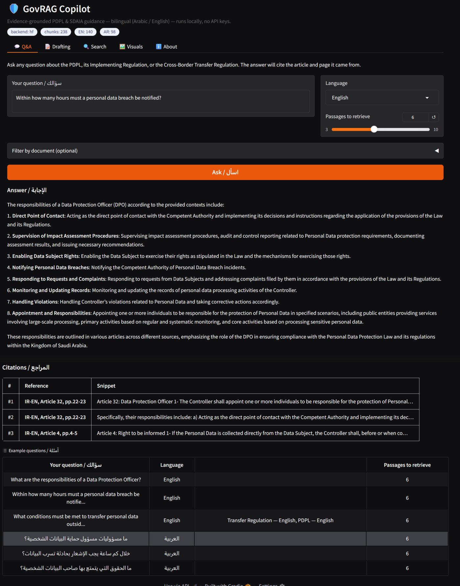
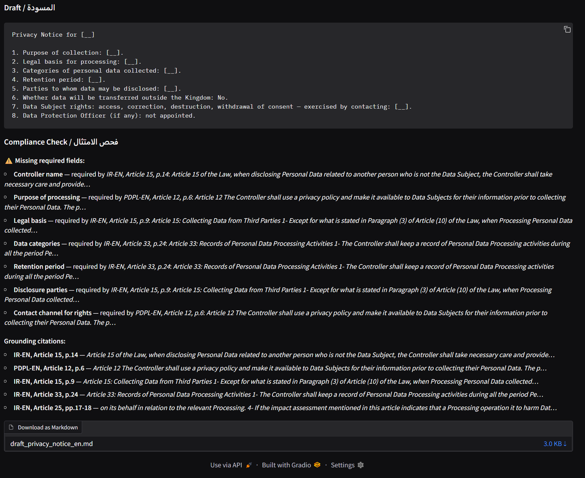
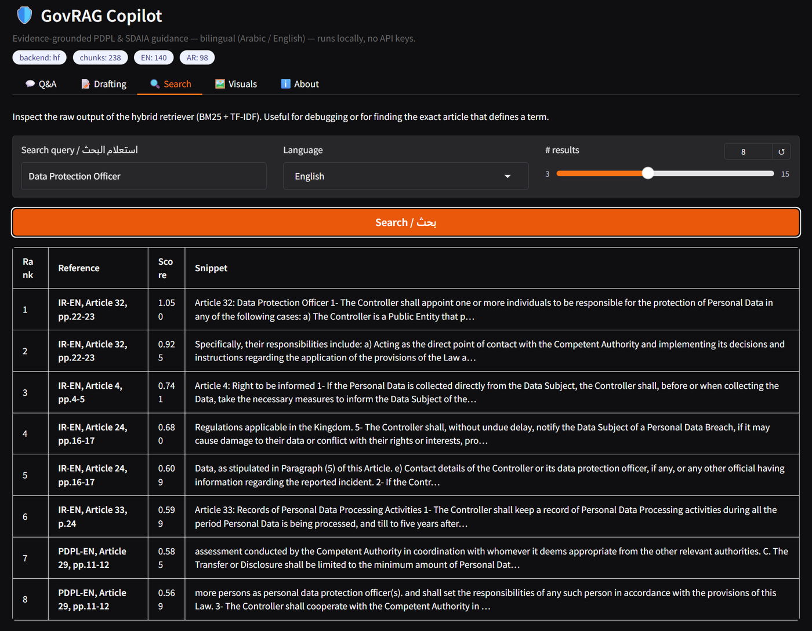
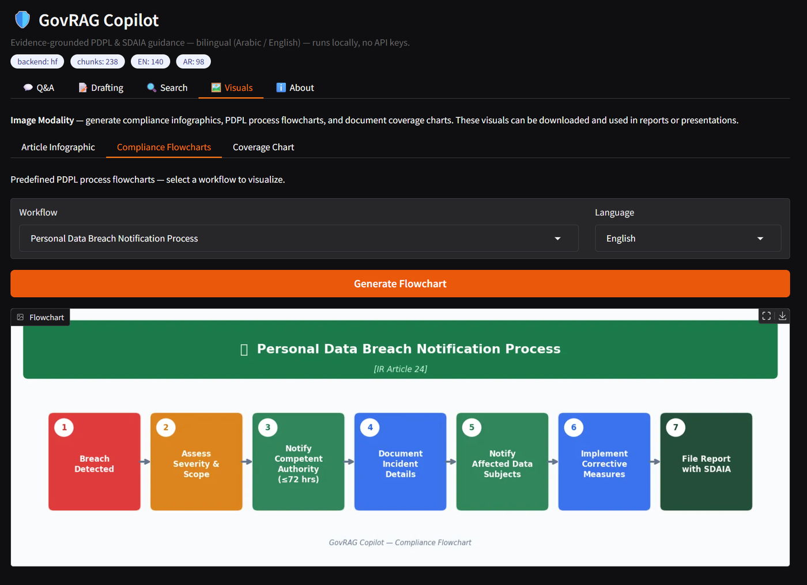
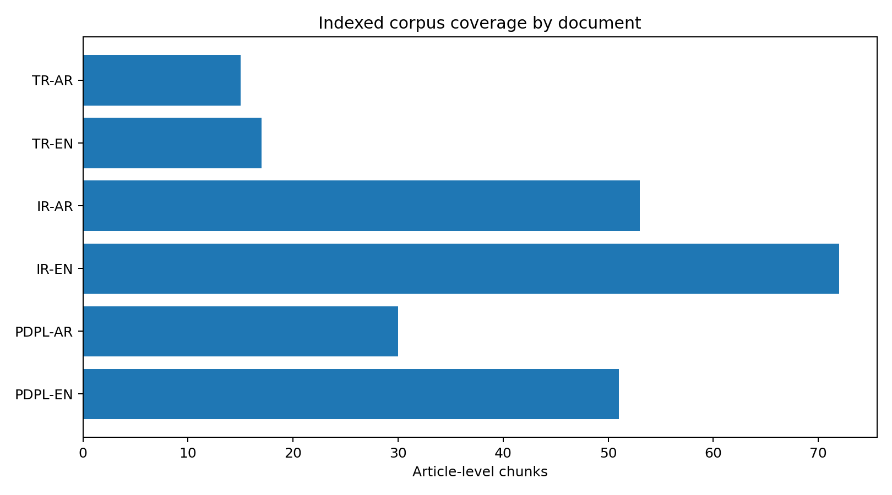
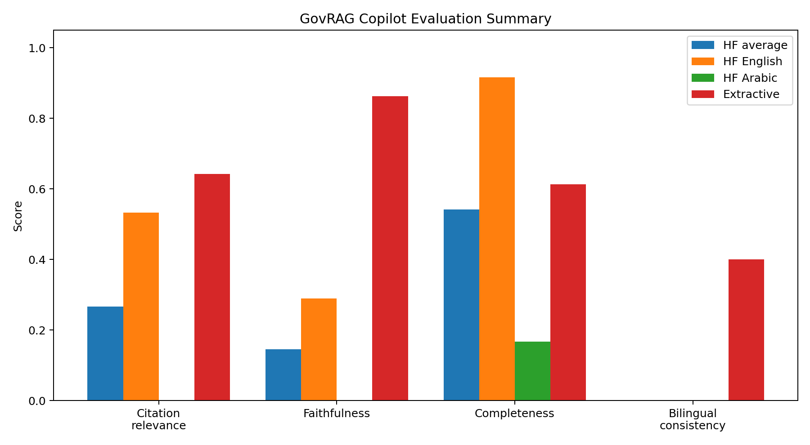
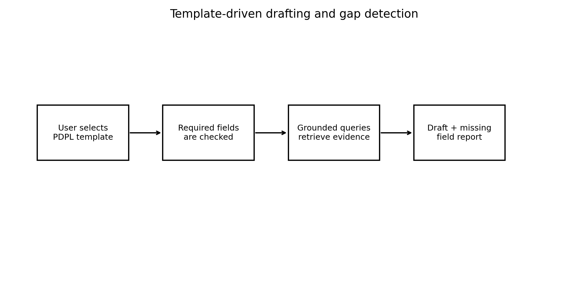

# GovRAG Copilot

Evidence-grounded bilingual RAG assistant for Saudi PDPL and SDAIA regulatory guidance.

GovRAG Copilot is a local Retrieval-Augmented Generation system that answers questions about Saudi Arabia's Personal Data Protection Law (PDPL), drafts compliance artifacts, and generates visual compliance outputs with article-level citations.

## Highlights

- Bilingual Arabic / English Q&A over PDPL and SDAIA regulatory sources.
- Evidence-grounded answers with inline citation markers and article/page metadata.
- Hybrid retrieval using BM25 + TF-IDF with Arabic normalization and domain query expansion.
- Three keyless generation modes: extractive, local Ollama, and HuggingFace Transformers.
- Template-driven drafting for privacy notices, ROPA entries, breach notifications, and cross-border transfer assessments.
- Gap detection that flags missing required fields and links each field to supporting regulatory evidence.
- Visual generation for compliance flowcharts, article infographics, gap report cards, and document coverage charts.
- Gradio web interface with Q&A, Drafting, Search, Visuals, and About tabs.
- Automated evaluation for citation relevance, faithfulness, completeness, and bilingual consistency.

## System Architecture



The system follows a modular RAG pipeline:

1. **Document ingestion** parses official regulatory documents and creates article-level chunks.
2. **Hybrid retrieval** combines BM25 and TF-IDF with bilingual normalization and query expansion.
3. **Generation** produces grounded answers using extractive, Ollama, or HuggingFace backends.
4. **Drafting** creates compliance artifacts and reports missing required fields.
5. **Visuals** generate local PNG outputs for reports and presentations.

## Demo Screenshots

### Evidence-Grounded Q&A

The Q&A interface returns an answer with retrieval metadata and article-level citations.



### Drafting and Gap Detection

The drafting tab generates PDPL compliance artifacts and flags missing required fields with supporting article references.



### Hybrid Search Inspection

The search tab exposes raw hybrid retrieval results for debugging and article-level evidence inspection.



### Visual Compliance Outputs

The visuals tab generates local compliance flowcharts and report-ready visual outputs.



## Indexed Document Scope

The project is designed around six SDAIA / PDPL source documents: three English documents and their Arabic counterparts.

| Short ID | Document | Language | Reported chunks |
|---|---|---:|---:|
| PDPL-EN | Personal Data Protection Law | English | 51 |
| PDPL-AR | نظام حماية البيانات الشخصية | Arabic | 30 |
| IR-EN | Implementing Regulation of the PDPL | English | 72 |
| IR-AR | اللائحة التنفيذية لنظام حماية البيانات الشخصية | Arabic | 53 |
| TR-EN | Regulation on Personal Data Transfer Outside the Kingdom | English | 17 |
| TR-AR | لائحة نقل البيانات الشخصية خارج المملكة | Arabic | 15 |
|  | **Total** |  | **238** |



## Evaluation Summary

The evaluation suite measures:

- **Citation relevance**: whether cited articles match the gold-standard article set.
- **Faithfulness**: overlap between generated answer text and retrieved source evidence.
- **Completeness**: coverage of expected answer facts.
- **Bilingual consistency**: overlap between cited articles in English and Arabic versions.



The HuggingFace Qwen2.5-1.5B-Instruct backend shows strong English completeness but weak Arabic generation quality. The extractive backend provides a faithful and stable baseline because it constructs answers directly from retrieved passages.

| Backend / setting | Citation relevance | Faithfulness | Completeness | Bilingual consistency |
|---|---:|---:|---:|---:|
| HuggingFace average | 0.267 | 0.145 | 0.542 | 0.000 |
| HuggingFace English | 0.533 | 0.289 | 0.917 | — |
| HuggingFace Arabic | 0.000 | 0.001 | 0.167 | — |
| Extractive backend | 0.642 | 0.863 | 0.613 | 0.400 |

## Template-Driven Drafting

GovRAG Copilot supports four compliance artifact templates:

| Template | Regulatory focus |
|---|---|
| Privacy Notice | PDPL notice requirements and implementing regulation details |
| ROPA Entry | Records of processing activities |
| Breach Notification | Personal data breach notification workflow |
| Cross-Border Transfer Assessment | Transfer outside the Kingdom assessment |



## Repository Structure

```text
.
├── src/
│   ├── ingest.py                 # Document loading, Arabic normalization, chunking
│   ├── index.py                  # BM25 + TF-IDF hybrid retriever
│   ├── generator.py              # Extractive, Ollama, and HuggingFace generators
│   ├── templates_module.py       # PDPL templates and gap detection
│   ├── visuals.py                # Local infographic and flowchart generation
│   ├── pipeline.py               # Main GovRAGPipeline orchestrator
│   ├── evaluate.py               # Evaluation metrics and bilingual consistency
│   └── build.py                  # Ingest documents and build retrieval index
├── ui/
│   └── app.py                    # Gradio web application
├── tests/                        # Unit and integration tests
├── scripts/                      # Setup and demo helper scripts
├── docs/
│   └── figures/                  # README figures
├── data/
│   ├── raw/                      # Local source documents
│   ├── processed/                # Generated chunks and reports
│   └── index/                    # Generated retrieval index
├── requirements.txt
└── README.md
```

## Installation

### Windows PowerShell

```powershell
git clone https://github.com/YOUR_USERNAME/govrag-copilot.git
cd govrag-copilot
py -3.10 -m venv .venv
.\.venv\Scripts\Activate.ps1
python -m pip install --upgrade pip
pip install -r requirements.txt
```

When PowerShell blocks virtual environment activation:

```powershell
Set-ExecutionPolicy -ExecutionPolicy RemoteSigned -Scope CurrentUser
```

### Linux / macOS

```bash
https://github.com/AlAsiri-Ali/govrag-copilot.git
cd govrag-copilot
python3 -m venv .venv
source .venv/bin/activate
python -m pip install --upgrade pip
pip install -r requirements.txt
```

## Prepare Documents

Place the source PDFs in `data/raw/` using the filenames registered in `src/ingest.py`. The expected document set is:

```text
PersonalDataProtectionLawEn.pdf
PersonalDataProtectionLawAr.pdf
ImplementingRegulationPersonalDataProtectionLawEn.pdf
ImplementingRegulationPersonalDataProtectionLawAr.pdf
RegulationonPersonalDataEn.pdf
RegulationonPersonalDataAr.pdf
```

Then build the retrieval index:

```bash
python src/build.py
```

Generated files are written to:

```text
data/processed/chunks.jsonl
data/index/hybrid.pkl
```

## Run the Web App

```bash
python ui/app.py
```

Open the local Gradio URL shown in the terminal, usually:

```text
http://localhost:7860
```

## Generation Backends

The system auto-selects the strongest available keyless backend:

```text
1. Ollama, when a local Ollama server is running
2. HuggingFace Transformers, when transformers and torch are installed
3. Extractive backend, always available
```

Force a backend with:

```bash
GOVRAG_BACKEND=extractive python ui/app.py
GOVRAG_BACKEND=hf python ui/app.py
GOVRAG_BACKEND=ollama python ui/app.py
```

### Ollama

```bash
ollama pull qwen2.5:7b-instruct
ollama serve
GOVRAG_OLLAMA_MODEL=qwen2.5:7b-instruct GOVRAG_BACKEND=ollama python ui/app.py
```

### HuggingFace Transformers

```bash
pip install "transformers>=4.45" "torch>=2.2" accelerate sentencepiece
GOVRAG_HF_MODEL=Qwen/Qwen2.5-1.5B-Instruct GOVRAG_BACKEND=hf python ui/app.py
```

## Programmatic Usage

```python
import sys
sys.path.insert(0, "src")

from pipeline import GovRAGPipeline

pipe = GovRAGPipeline(backend="extractive")

answer = pipe.answer(
    "Within how many hours must a personal data breach be notified?",
    lang="en",
)

print(answer.answer)
for citation in answer.citations:
    print(citation["label"], citation["snippet"])
```

Generate a draft:

```python
draft = pipe.draft(
    "privacy_notice",
    inputs={
        "controller_name": "Example Organization",
        "purpose": "customer account management",
    },
    lang="en",
)

print(draft.draft)
print(draft.missing_fields)
```

## Run Tests

```bash
pytest tests/ -v
```

Some integration tests require a built local index at `data/index/hybrid.pkl`. Build the index first with:

```bash
python src/build.py
```

## Visual Outputs

The `src/visuals.py` module generates local PNG visuals using matplotlib and Pillow:

- Article summary infographics
- PDPL process flowcharts
- Gap report cards
- Document coverage charts

The visuals can be displayed inside the Gradio UI or exported for reports and presentations.

## Limitations

- Small multilingual models may underperform on Arabic generation.
- Lexical retrieval is strong for legal keywords but may miss semantically similar wording.
- Larger evaluation sets are needed for production-level validation.
- Arabic rendering in matplotlib can require additional font and shaping support.
- The system is a research prototype and is not legal advice.

## Acknowledgments

This implementation builds on open-source tools and publicly available regulatory materials, including PyTorch-compatible open-weight models, Gradio, scikit-learn, pypdf, matplotlib, Pillow, Ollama, HuggingFace Transformers, and SDAIA-published PDPL resources.
